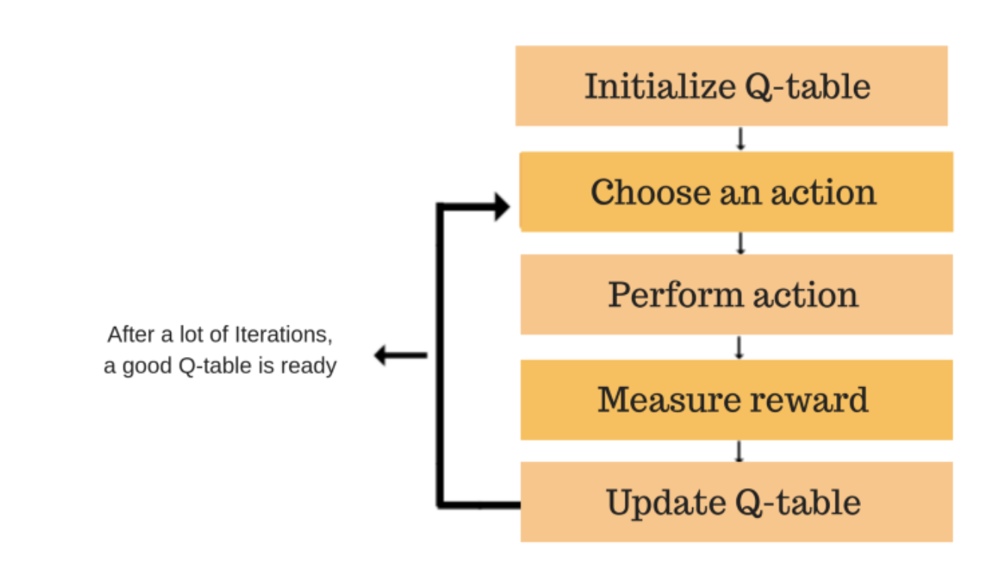
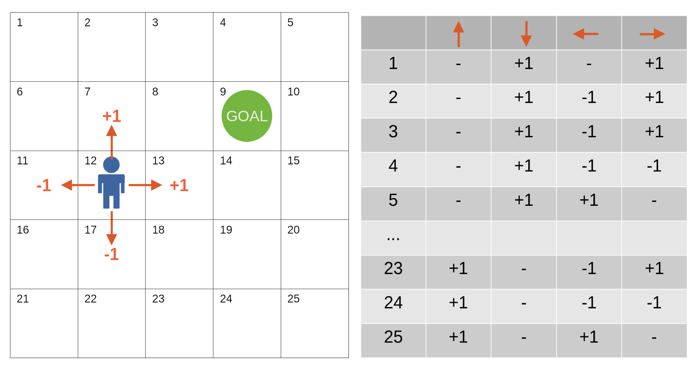

# Ensemble learning

## diverse set of classifiers:

- use very different training algorithms.
- same training algorithm for every predictor, but to train them on different random subsets of the training set.

## bagging vs pasting

- Bagging you allow the same data or features to be shared by multiple models. with replacing
- Pasting you don't allow the same data or features to be shared by multiple models. without replacing

### When to Use Which?

- Bagging: Use when you have a smaller dataset or when you want to reduce the variance of a high-variance model.
- Pasting: Use when you have a larger dataset and want to ensure each subset is unique and comprehensive.

## aggregating the predictions of all predictors:

- the average for regression.
- hard voting classifier: aggregate the predictions of each classifier and predict the class that gets the most votes. majority-vote classifier

## Out-of-Bag Evaluation

- With bagging, some instances may be sampled several times for any given predictor, while others may not be sampled at all. By default a BaggingClassifier samples m training instances with replacement (bootstrap=True), where m is the size of the training set.
- This means that only about 63% of the training instances are sampled on average for each predictor. The remaining 37% of the training instances that are not sampled are called out-of-bag (oob) instances. Note that they are not the same 37% for all predictors.

### solution

Since a predictor never sees the oob instances during training, it can be evaluated on these instances.

## Random Patches and Random Subspaces

max_samples = 1 (means you want to have 100% of the data to get sampled for each predictor) less than one (means that you want random selection of data for each model)
bootstrap = false (pasting), true (bagging)
max_features = 1
bootstrap_features

- Random Patches: both instances and features sampling. This means setting both `max_samples` and `max_features` to less than 1.0, ensuring that each predictor in the ensemble is trained on a random subset of both the training instances and features.
  - This method would help in reducing variance and avoiding overfitting, which is crucial in high-dimensional spaces.
  - Advantages: This approach not only curbs overfitting but also enhances the diversity of the models in the ensemble, leading to better generalization on unseen data.
- Random Subspaces: Random Subspaces method focuses on feature sampling only, keeping all instances. This is done by setting `max_samples` to 1.0 and `max_features` to a fraction less than 1.0.
  - Purpose and Benefits: By varying the features used in each model, this method increases feature space diversity, potentially capturing unique interactions between features that may be missed when using all features. This is particularly advantageous in genetic datasets where interactions between genes (features) can be significant.

## Random Forest

Instead of building a BaggingClassifier and passing it a DecisionTreeClassifier, you can instead use the RandomForestClassifier.

## Boosting

any Ensemble method that can combine several weak learners into a strong learner

# AdaBoost

- One way for a new predictor to correct its predecessor is to pay a bit more attention to the training instances that the predecessor underfitted. This results in new predictors focusing more and more on the hard cases. This is the technique used by AdaBoost.
- For example, to build an AdaBoost classifier, a first base classifier (such as a Decision Tree) is trained and used to make predictions on the training set. The relative weight of misclassified training instances is then increased. A second classifier is trained using the updated weights and again it makes predictions on the training set, weights are updated, and so on.
  
- The idea behind AdaBoost is to improve the classification accuracy by training a series of weak classifiers, each focusing on the mistakes of its predecessors, and combining their decisions to produce the final prediction.

## Here's how AdaBoost generally works:

1. Initialize Weights: Start by assigning equal weights to all instances in the training dataset.
2. Train Weak Classifiers: Iteratively train weak classifiers (usually simple models like decision stumps). In each iteration:
   1. Train a classifier using the weighted instances.
   2. Calculate the error of the classifier based on these weights.
   3. Assign more weight to instances that were misclassified, making it more likely for future classifiers to focus on these.
3. Calculate Classifier Weights: Assign a weight to each classifier based on its accuracy. More accurate classifiers have higher weights.
4. Combine Classifiers: Aggregate the decisions of all the classifiers, weighted by their respective accuracies, to make the final prediction

## characteristics and examples of weak classifiers

1. Simplicity: Weak classifiers are generally simple due to their limited complexity and decision-making capabilities. They often use a simple rule or decision boundary to classify data.
2. Examples:
   1. Decision Stumps: These are decision trees with only one decision node (the root) and two leaves. They make a decision based on the value of just one input feature.
   2. Small Decision Trees: Trees with a few splits are slightly more complex than stumps but still considered weak.
   3. Perceptrons: As a simple form of neural networks, perceptrons can act as weak classifiers when they categorize data using a single linear boundary.
3. Error Rate: The key requirement for a weak classifier is that its error rate should be better than flipping a coin, meaning it should be correct more than 50% of the time on binary classification tasks.

## Effect on the Learning Process

## Weighted Sampling or Cost Adjustment:

Depending on the implementation, the algorithm might sample instances with a probability proportional to their weights for training subsequent classifiers, or it might adjust the cost of misclassification based on weights directly. In either case, instances with higher weights are either more likely to be included in the training set or they make the error costlier if misclassified again.

## Handling of Low Weight Instances

### Decreased Influence

Conversely, instances that are correctly classified see their weights decreased. This reduction in weight means that these instances become less influential in the training process of subsequent learners. They contribute less to the error term, and as a result, the model may not focus as much on getting these already correctly classified instances right.

### Risk of Underfitting

While the emphasis on hard-to-classify instances helps to improve the model's performance on difficult parts of the data, there is a potential risk. If the weights of some instances become too small, they might be effectively ignored by the model, possibly leading to underfitting on these parts of the data. However, because the weights are normalized so that their sum remains constant, no instance's weight becomes absolute zero, ensuring they still have some influence.

### Dynamic Adjustment Ensures Balance

The dynamic adjustment of weights after each iteration ensures that the training focus can shift back and forth between different parts of the data as needed. If a previously hard-to-classify instance starts getting classified correctly, its weight decreases, and other still-misclassified instances' weights increase, shifting the focus continually. This adaptability helps AdaBoost and similar methods remain balanced, focusing on different challenges in the dataset over the course of many iterations.

# Gradient Boosting

Another very popular Boosting algorithm is Gradient Boosting. Just like AdaBoost, Gradient Boosting works by sequentially adding predictors to an ensemble, each one correcting its predecessor. However, instead of tweaking the instance weights at every iteration like AdaBoost does, this method tries to fit the new predictor to the residual errors made by the previous predictor.

## Here's how Gradient Boosting generally works:

1. Initial Prediction: Start with a basic prediction for each instance. This could be something simple like the mean of the target values. This is your initial prediction for all instances.
2. Calculate Residuals: Compute the residuals for each instance. The residual is the difference between the actual target value and your current prediction. Essentially, it represents how much your model is off for each instance.
3. Train Model on Residuals: Train a new model, not on the original target, but on these residuals. The goal of this model is to predict these residuals based on the input features. This means that this model is trying to learn the errors of the previous model.
4. Update Predictions: Use the predictions from this new model (which are predictions of the residuals) to update your initial predictions. You adjust your existing predictions by adding the predicted residuals (usually scaled by a learning rate) to them. This gives you a new set of improved predictions.
5. Recalculate Residuals: With your updated predictions, calculate new residuals. These new residuals are again the differences between the actual target values and your updated predictions.
6. Repeat: Train another model on these new residuals and use its output to update your predictions again. This cycle continues for a fixed number of iterations, or until the improvements become negligibly small.
7. Final Model: The ensemble of all these sequentially trained models, each correcting the predecessor's errors, forms your final predictive model.

# Stacking

It is based on a simple idea: instead of using trivial functions (such as hard voting) to aggregate the predictions of all predictors in an ensemble, why don’t we train a model to perform this aggregation?

- split the data set into 2 subsets
- use the first subset to train the predictors in the first layer
- the first layer predictors are used to make predictions on the second (held-out) set
- now you have all (number of predictors) predictions
- combine all predictions with the actual value
- train the Blender on this dataset so the blender in the future can predict the correct value depending on it's training not based on voting.

### It is actually possible to train several different blenders

- The idea to split your dataset into 3 datasets
- use the first dataset to train the predictors
- use the second layer to predict the second dataset and create the combined data to train the blenders
- use the 3rd dataset to predict the dataset that you will train final blender on it
- so the first layer is for the predictors
- second layer for the blenders
- third layer for the final blender
  

# Advanced CNN Architectures and Transfer Learning

## AlexNet

- Local Response Normalization (LRN):
  - Purpose: LRN was designed to mimic the biological process of lateral inhibition, where neurons inhibit the activation of their neighbors, enhancing the features with large activations and suppressing those with small ones.
- Dropout
- Data Augmentation
- GPU Parallelization

## VGGNet

- Simplicity and Uniformity
  - It uses small (3x3) convolutional filters consistently across all layers,
- Feature Extraction
  - Pre-trained Model Utility: VGGNet excels at extracting features from images. When used as a pre-trained model
  - Transfer Learning: The features learned by VGGNet can be transferred to other tasks, making it highly effective for transfer learning applications

## GoogLeNet/Inception

### inception module

- it can capture features that are highly detailed, complex more effectively
- Dimensionality Reduction: The inception module smartly incorporates 1x1 convolutions to reduce the dimensionality of the input feature map before applying larger convolutions, effectively controlling the computational cost and the number of parameters.

## ResNet

- Residual Learning Principle: ResNet addresses the vanishing gradient problem through the introduction of residual learning blocks. These blocks allow gradients to flow through the network directly, without passing through multiple layers of non-linear transformations.
- Impact: This design not only mitigated the vanishing gradient problem but also improved the training speed and performance of deep neural networks, enabling the construction of models with over a hundred layers.

## DenseNet

- It addresses efficiency in learning by introducing novel connectivity patterns.
- Innovative Connectivity: Unlike traditional architectures where layers are connected sequentially, DenseNet connects each layer to every other layer in a feed-forward fashion. This means every layer receives additional inputs from all preceding layers and passes on its own feature-maps to all subsequent layers.

## Transfer Learning

### Customizing Pre-trained Models for New Tasks

- Selecting the Right Base Model: The choice of pre-trained model can significantly impact performance. It's essential to select a model pre-trained on a sufficiently large and diverse dataset that has learned a broad range of features. The architecture of the model (e.g., ResNet, Inception, VGG) should also be appropriate for the complexity of the new task.
- Adapting the Model to the New Task:
  1. Replacing the Top Layer: The most common customization is replacing the top layer(s) of the model (which make the final classification decision) with new layers tailored to the new task. For instance, changing the output layer to match the number of classes in the new task.
  2. Training Strategy: Deciding whether to freeze the weights of the pre-trained layers during training or allow them to update (fine-tuning). If the dataset for the new task is small, it's usually better to freeze most of the pre-trained layers to prevent overfitting.
  3. Data Preprocessing: The input data should be preprocessed in the same way as the data used to train the pre-trained model. This ensures the features extracted by the pre-trained layers are relevant and meaningful for the new task.

# Unsupervised Learning

The main goal is to model the underlying structure or distribution in the data to learn more about the data itself.

## Clustering

Clustering is a method of unsupervised learning that involves grouping a set of objects in such a way that objects in the same group (called a cluster) are more similar to each other than to those in other groups.

## Importance of Clustering:

- Data Exploration: Offers initial insights into the data distribution and structure, facilitating hypothesis generation and feature selection.
- Pattern Recognition: Essential in identifying patterns or behaviors in datasets, aiding in anomaly detection, customer segmentation, and bioinformatics.
- Efficiency in Computation: By grouping similar data points, clustering can reduce the complexity of data processing for further analysis or supervised learning.

## Types of Clustering:

- Exclusive (Hard) Clustering: Each data point belongs to exactly one cluster.
- Overlapping (Soft) Clustering: Data points can belong to multiple clusters with varying degrees of membership.
- Hierarchical Clustering: Builds a multilevel hierarchy of clusters by creating a dendrogram.
- Density-Based Clustering: Forms clusters based on areas of high density, separating outliers in sparse areas.

## Challenges and Considerations:

- Determining the Number of Clusters: Often, the optimal number of clusters is not known a priori and must be determined using methods like the Elbow Method or the Silhouette Method.
- Scalability and Computational Cost: Some algorithms, like hierarchical clustering, may not scale well to very large datasets.
- Sensitivity to Initial Conditions: Algorithms like K-means can produce different outcomes depending on initial seed points, requiring multiple runs for robust results.

## K-means Clustering

K-means is one of the simplest and most commonly used clustering algorithms that partitions n observations into k clusters where each observation belongs to the cluster with the nearest mean (cluster centers or centroids), serving as a prototype of the cluster.

- Algorithm Steps:

  - Initialization: Select k initial centroids (either randomly or based on some heuristic).
  - Assignment: Assign each data point to the nearest centroid based on the chosen distance metric (usually Euclidean distance), forming k clusters.
  - Update: Recalculate the centroids as the mean of all points in the cluster.
  - Repeat: Continue the assignment and update steps until the centroids no longer change significantly, indicating convergence.

- Challenges:
  - Choosing k: Determining the right number of clusters is critical and often achieved using methods like the Elbow Method, the Silhouette Coefficient, or the Gap Statistic.
  - Sensitivity to Initial Centroids: The final outcome can significantly depend on the initial selection of centroids. Techniques like k-means++ improve centroid initialization.
  - Convexity Bias: Assumes clusters are convex and isotropic, which might not be the case, leading to poor performance on complex shapes

## Hierarchical Clustering

Hierarchical clustering is a method of cluster analysis which seeks to build a hierarchy of clusters. Unlike K-means, it does not require pre-specifying the number of clusters to be generated. The process is visualized as a dendrogram - a tree-like diagram that records the sequences of merges or splits.

- Types of Hierarchical Clustering:

  - Agglomerative (Bottom-Up): Starts with each data point as its own cluster and merges them into larger clusters.
  - Divisive (Top-Down): Starts with all data points in a single cluster and recursively splits the most heterogeneous cluster until only singleton clusters remain

- Key Steps (Agglomerative):

  - Initialization: Treat each data point as a single cluster.
  - Find the Closest Pair: Identify the two clusters closest to each other based on a chosen distance metric (e.g., Euclidean, Manhattan, Cosine).
  - Merge: Combine the closest pairs into a single cluster.
  - Update Distance Matrix: Recalculate the distance between the new cluster and the original clusters.
  - Repeat: Continue until all data points are clustered into a single hierarchical tree.

- Advantages:

  - No Need to Specify Number of Clusters: The dendrogram provides a rich representation that can be cut at different heights to yield different clustering solutions.
  - Flexibility in Distance Metrics: Allows the use of various distance metrics, tailored to the specific needs of the dataset.

- Challenges:
  - Computational Complexity: Especially for agglomerative clustering, the computational cost is high for large datasets, making it less scalable than K-means.
  - Sensitivity to Noise and Outliers: Similar to other clustering methods, hierarchical clustering is sensitive to noise and outliers, which can lead to misleading hierarchies.

## DBSCAN

DBSCAN stands for Density-Based Spatial Clustering of Applications with Noise, a popular clustering algorithm known for its ability to identify clusters of varying shapes and sizes, and its robustness to outliers. Unlike centroid-based algorithms like K-means, DBSCAN is based on density estimation.

- Core Principles:

  - Density Estimation: Clusters are defined as high-density areas separated by areas of low density. This allows for the identification of clusters with irregular shapes.
  - Core Points: A point is a core point if at least a minimum number of points (MinPts) are within a given distance (ε, epsilon) of it, indicating a dense region.
  - Border Points: Points that are not core points but are within ε distance of a core point.
  - Noise Points: Points that are neither core nor border points. These are considered outliers.

- Algorithm Steps:

  - Classification of Points: Each point is classified as a core, border, or noise point based on ε and MinPts.
  - Cluster Formation: Starting from a core point, the cluster is expanded by recursively adding all directly reachable points (core or border) to the cluster.
  - Process Each Point: Iterate through each point in the dataset, skipping already classified points, until all points are assigned to a cluster or marked as noise.

- Advantages:

  - No Assumption on Cluster Shapes: Effectively handles clusters of arbitrary shapes and sizes.
  - Robustness to Outliers: Naturally identifies and ignores noise or outlier data points.
  - Minimal Input Parameters: Requires only two parameters (ε and MinPts), making it relatively easy to configure.

- Challenges:

  - Parameter Sensitivity: Choosing appropriate values for ε and MinPts can be non-trivial and heavily influences the clustering outcome.
  - Variable Density Clusters: Struggles with clusters of varying densities, where a single set of parameters might not fit all clusters well.
  - Scalability: The computational complexity can be high for large datasets with many dimensions (curse of dimensionality).

## Dimensionality Reduction

Dimensionality reduction is a fundamental preprocessing step in machine learning that involves reducing the number of input variables in a dataset. It helps in simplifying models, accelerating algorithms, combating the "curse of dimensionality," and enhancing data visualization.

- Why Dimensionality Reduction?

  - Curse of Dimensionality: As the number of features or dimensions grows, the amount of data needed to generalize accurately grows exponentially.
  - Noise Reduction: Eliminates redundant and irrelevant features, improving model performance.
  - Improved Visualization: Reduces dimensions to 2D or 3D for visual analysis, revealing patterns and relationships not visible in high-dimensional space.
  - Computational Efficiency: Reduces the computational cost of processing, storing, and analyzing high-dimensional datasets.

- Key Techniques

  - Feature Selection: Selecting a subset of the most relevant features to use in model construction. Techniques include filter methods, wrapper methods, and embedded methods.
  - Feature Extraction: Transforming the data into a lower-dimensional space where the transformed features are a combination of the original ones. Techniques include Principal Component Analysis (PCA), Linear Discriminant Analysis (LDA), and t-Distributed Stochastic Neighbor Embedding (t-SNE).

- Challenges:

  - Choosing the Right Technique: The effectiveness of dimensionality reduction depends heavily on the technique chosen and its appropriateness for the dataset and task at hand.
  - Loss of Information: While reducing dimensions, there's a trade-off between simplicity and retaining the variance (information) of the original dataset.
  - Interpretability: Some techniques, especially non-linear ones like t-SNE, can make the resulting dimensions hard to interpret in terms of the original features.

- Principal Component Analysis (PCA)

  - A statistical procedure that uses an orthogonal transformation to convert a set of observations of possibly correlated variables into a set of values of linearly uncorrelated variables called principal components.
  - The first principal component has the largest possible variance, and each succeeding component has the highest variance possible under the constraint that it is orthogonal to the preceding components.

- t-Distributed Stochastic Neighbor Embedding (t-SNE)

  - A non-linear dimensionality reduction technique well-suited for embedding high-dimensional data for visualization in a low-dimensional space of two or three dimensions.
  - Particularly effective at revealing patterns in the data by grouping similar data points together and separating dissimilar ones.

## Autoencoders

Autoencoders are a type of neural network used for unsupervised learning. They aim to learn a compressed, distributed representation (encoding) for a dataset, typically for the purpose of dimensionality reduction or feature learning.

- Architecture:

  - Encoder: The first part of the network compresses the input into a latent-space representation. It learns to preserve as much of the significant information as possible while reducing dimensionality.
  - Decoder: The second part reconstructs the input data from the latent space representation. The goal is to minimize the difference between the input and its reconstruction, typically measured by a loss function like mean squared error.
  - Latent Space: A compressed knowledge representation of the original input data. It is the output of the encoder and the input to the decoder.

- Working Mechanism:
  - By training the network to reproduce its input, autoencoders learn to identify patterns and important features in the data. The process forces the network to prioritize which aspects of the input should be retained or discarded, resulting in a powerful tool for feature extraction and data compression.

## Reinforcement Learning

Reinforcement Learning (RL) is a type of machine learning where an agent learns to make decisions by performing actions in an environment to maximize cumulative reward.

1. Key Elements of RL:

   1. Agent: The decision-maker.
   2. Environment: The world with which the agent interacts.
   3. State (s): The current situation of the agent.
   4. Action (a): The set of all possible moves the agent can make.
   5. Reward (r): The feedback from the environment.

2. Process Flow:

   1. The agent observes the current state.
   2. It selects an action based on its policy.
   3. The action affects the environment, transitioning to a new state.
   4. The agent receives a reward based on the action and the new state.
   5. The process repeats, and the agent learns to optimize its actions over time.

3. Objective of RL:

   1. To find a policy that maximizes the expected cumulative reward over time.

4. Key Concepts:

   1. Learning from Interaction: The agent learns by taking actions and receiving feedback.
   2. Goal-Oriented Learning: The aim is to maximize cumulative reward over time.
   3. Trial-and-Error: The agent explores different actions to discover the best strategy.
   4. Delayed Reward: The effect of actions may not be immediate, requiring the agent to learn long-term strategies.

## Policy: Definition and Types (Deterministic vs. Stochastic)

A policy in reinforcement learning is a strategy or a mapping from states to actions that defines the behavior of an agent.

- Types of Policies:

  - Deterministic Policy: A deterministic policy directly maps each state to a specific action.
  - Stochastic Policy: A stochastic policy provides a probability distribution over actions for each state.

- Bellman Equation

  - recursive formula used in reinforcement learning to calculate the value of a state or state-action pair, it provides a relationship between the value of a state and the values of its successor states.

- Bellman Expectation Equation

  - The Bellman Expectation Equation extends the Bellman Equation to evaluate the expected value of a state or state-action pair under a specific policy π.

- Bellman Optimality Equation

  - The Bellman Optimality Equation is used to find the optimal value function by maximizing the expected return over all possible actions.

- Trade-off

  - In reinforcement learning, the exploration vs. exploitation trade-off refers to the dilemma of choosing between exploring new actions to discover their effects (exploration) and using known actions that yield high rewards (exploitation).
    - Exploration: To gather information about the environment
    - Exploitation: To maximize immediate reward using known information

- Importance of Balancing the Trade-off

  - Short-Term vs. Long-Term Rewards: Balancing immediate gains with the potential of discovering better long-term strategies.
  - Learning Efficiency: Efficient learning requires a balance to avoid excessive exploration or premature convergence on suboptimal policies.
  - Adaptation: The balance allows the agent to adapt to changing environments and improve performance over time.

- Strategies

  - ε-Greedy

    - With probability ε, choose a random action (exploration).
    - With probability 1−ε, choose the best-known action (exploitation).
    - Simple to implement.
    - Provides a straightforward balance between exploration and exploitation.

  - Softmax

    - Chooses actions probabilistically based on their estimated value, using a softmax distribution
    - τ(temperature parameter) controls exploration level.
    - Higher τ increases exploration, lower τ increases exploitation.

  - Upper Confidence Bound (UCB)

    - Chooses actions based on both the estimated value and the uncertainty or variance in the estimate.
    - Balances exploration and exploitation by considering the confidence interval.
    - Encourages actions with high uncertainty to be explored.

- Comparison:
  1. ε-Greedy: Simple and easy to implement, but may not adapt well.
  2. Softmax: Provides a smooth transition between exploration and exploitation.
  3. UCB: Balances exploration with confidence, suitable for problems with known variance.

## Model-Based vs. Model-Free RL

In reinforcement learning, approaches can be broadly categorized into model-based and model-free methods, each with distinct characteristics and use cases.

- Model-Based RL

  - Model-based RL methods use a model of the environment to make decisions. This model predicts the next state and reward given a state and action
  - Planning: Use the model to simulate the environment and plan actions

- Model-Free RL

  - Model-free RL methods learn policies or value functions directly from interactions with the environment without explicitly modeling the environment.
  - Trial and Error

- Comparison:

  1. Planning vs. Learning:
     1. Model-Based: Emphasizes planning using a model.
     2. Model-Free: Focuses on learning from direct interaction.
  2. Sample Efficiency:
     1. Model-Based: Typically more sample-efficient.
     2. Model-Free: Generally less sample-efficient.
  3. Computational Requirements:
     1. Model-Based: Higher computational requirements for model maintenance and planning.
     2. Model-Free: Lower computational requirements, focusing on policy or value updates.

## Q-Learning

Q-Learning is a model-free reinforcement learning algorithm that aims to find the best action to take given the current state.

