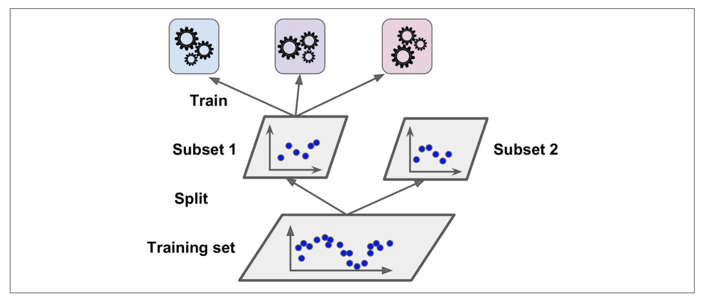

# Ensemble learning

## diverse set of classifiers:

- use very different training algorithms.
- same training algorithm for every predictor, but to train them on different random subsets of the training set.

## bagging vs pasting

- Bagging you allow the same data or features to be shared by multiple models.
- Pasting you don't allow the same data or features to be shared by multiple models.

### When to Use Which?

- Bagging: Use when you have a smaller dataset or when you want to reduce the variance of a high-variance model.
- Pasting: Use when you have a larger dataset and want to ensure each subset is unique and comprehensive.

## aggregating the predictions of all predictors:

- the average for regression.
- hard voting classifier: aggregate the predictions of each classifier and predict the class that gets the most votes. majority-vote classifier

## Out-of-Bag Evaluation

- With bagging, some instances may be sampled several times for any given predictor, while others may not be sampled at all. By default a BaggingClassifier samples m training instances with replacement (bootstrap=True), where m is the size of the training set.
- This means that only about 63% of the training instances are sampled on average for each predictor. The remaining 37% of the training instances that are not sampled are called out-of-bag (oob) instances. Note that they are not the same 37% for all predictors.

### solution

Since a predictor never sees the oob instances during training, it can be evaluated on these instances.

## Random Patches and Random Subspaces

max_samples = 1 (means you want to have 100% of the data to get sampled for each predictor) less than one (means that you want random selection of data for each model)
bootstrap = false (pasting), true (bagging)
max_features = 1
bootstrap_features

- Random Patches: both instances and features sampling. This means setting both `max_samples` and `max_features` to less than 1.0, ensuring that each predictor in the ensemble is trained on a random subset of both the training instances and features.
  - This method would help in reducing variance and avoiding overfitting, which is crucial in high-dimensional spaces.
  - Advantages: This approach not only curbs overfitting but also enhances the diversity of the models in the ensemble, leading to better generalization on unseen data.
- Random Subspaces: Random Subspaces method focuses on feature sampling only, keeping all instances. This is done by setting `max_samples` to 1.0 and `max_features` to a fraction less than 1.0.
  - Purpose and Benefits: By varying the features used in each model, this method increases feature space diversity, potentially capturing unique interactions between features that may be missed when using all features. This is particularly advantageous in genetic datasets where interactions between genes (features) can be significant.

## Random Forest

Instead of building a BaggingClassifier and passing it a DecisionTreeClassifier, you can instead use the RandomForestClassifier.

## Boosting

any Ensemble method that can combine several weak learners into a strong learner

# AdaBoost

- One way for a new predictor to correct its predecessor is to pay a bit more attention to the training instances that the predecessor underfitted. This results in new predictors focusing more and more on the hard cases. This is the technique used by AdaBoost.
- For example, to build an AdaBoost classifier, a first base classifier (such as a Decision Tree) is trained and used to make predictions on the training set. The relative weight of misclassified training instances is then increased. A second classifier is trained using the updated weights and again it makes predictions on the training set, weights are updated, and so on.
  
- The idea behind AdaBoost is to improve the classification accuracy by training a series of weak classifiers, each focusing on the mistakes of its predecessors, and combining their decisions to produce the final prediction.

## Here's how AdaBoost generally works:

1. Initialize Weights: Start by assigning equal weights to all instances in the training dataset.
2. Train Weak Classifiers: Iteratively train weak classifiers (usually simple models like decision stumps). In each iteration:
   1. Train a classifier using the weighted instances.
   2. Calculate the error of the classifier based on these weights.
   3. Assign more weight to instances that were misclassified, making it more likely for future classifiers to focus on these.
3. Calculate Classifier Weights: Assign a weight to each classifier based on its accuracy. More accurate classifiers have higher weights.
4. Combine Classifiers: Aggregate the decisions of all the classifiers, weighted by their respective accuracies, to make the final prediction

## characteristics and examples of weak classifiers

1. Simplicity: Weak classifiers are generally simple due to their limited complexity and decision-making capabilities. They often use a simple rule or decision boundary to classify data.
2. Examples:
   1. Decision Stumps: These are decision trees with only one decision node (the root) and two leaves. They make a decision based on the value of just one input feature.
   2. Small Decision Trees: Trees with a few splits are slightly more complex than stumps but still considered weak.
   3. Perceptrons: As a simple form of neural networks, perceptrons can act as weak classifiers when they categorize data using a single linear boundary.
3. Error Rate: The key requirement for a weak classifier is that its error rate should be better than flipping a coin, meaning it should be correct more than 50% of the time on binary classification tasks.

## Effect on the Learning Process

## Weighted Sampling or Cost Adjustment:

Depending on the implementation, the algorithm might sample instances with a probability proportional to their weights for training subsequent classifiers, or it might adjust the cost of misclassification based on weights directly. In either case, instances with higher weights are either more likely to be included in the training set or they make the error costlier if misclassified again.

## Handling of Low Weight Instances

### Decreased Influence

Conversely, instances that are correctly classified see their weights decreased. This reduction in weight means that these instances become less influential in the training process of subsequent learners. They contribute less to the error term, and as a result, the model may not focus as much on getting these already correctly classified instances right.

### Risk of Underfitting

While the emphasis on hard-to-classify instances helps to improve the model's performance on difficult parts of the data, there is a potential risk. If the weights of some instances become too small, they might be effectively ignored by the model, possibly leading to underfitting on these parts of the data. However, because the weights are normalized so that their sum remains constant, no instance's weight becomes absolute zero, ensuring they still have some influence.

### Dynamic Adjustment Ensures Balance

The dynamic adjustment of weights after each iteration ensures that the training focus can shift back and forth between different parts of the data as needed. If a previously hard-to-classify instance starts getting classified correctly, its weight decreases, and other still-misclassified instances' weights increase, shifting the focus continually. This adaptability helps AdaBoost and similar methods remain balanced, focusing on different challenges in the dataset over the course of many iterations.

# Gradient Boosting

Another very popular Boosting algorithm is Gradient Boosting. Just like AdaBoost, Gradient Boosting works by sequentially adding predictors to an ensemble, each one correcting its predecessor. However, instead of tweaking the instance weights at every iteration like AdaBoost does, this method tries to fit the new predictor to the residual errors made by the previous predictor.

## Here's how Gradient Boosting generally works:

1. Initial Prediction: Start with a basic prediction for each instance. This could be something simple like the mean of the target values. This is your initial prediction for all instances.
2. Calculate Residuals: Compute the residuals for each instance. The residual is the difference between the actual target value and your current prediction. Essentially, it represents how much your model is off for each instance.
3. Train Model on Residuals: Train a new model, not on the original target, but on these residuals. The goal of this model is to predict these residuals based on the input features. This means that this model is trying to learn the errors of the previous model.
4. Update Predictions: Use the predictions from this new model (which are predictions of the residuals) to update your initial predictions. You adjust your existing predictions by adding the predicted residuals (usually scaled by a learning rate) to them. This gives you a new set of improved predictions.
5. Recalculate Residuals: With your updated predictions, calculate new residuals. These new residuals are again the differences between the actual target values and your updated predictions.
6. Repeat: Train another model on these new residuals and use its output to update your predictions again. This cycle continues for a fixed number of iterations, or until the improvements become negligibly small.
7. Final Model: The ensemble of all these sequentially trained models, each correcting the predecessor's errors, forms your final predictive model.

# Stacking

It is based on a simple idea: instead of using trivial functions (such as hard voting) to aggregate the predictions of all predictors in an ensemble, why don’t we train a model to perform this aggregation?

- split the data set into 2 subsets
- use the first subset to train the predictors in the first layer
- the first layer predictors are used to make predictions on the second (held-out) set
- now you have all (number of predictors) predictions
- combine all predictions with the actual value
- train the Blender on this dataset so the blender in the future can predict the correct value depending on it's training not based on voting.

### It is actually possible to train several different blenders

- The idea to split your dataset into 3 datasets
- use the first dataset to train the predictors
- use the second layer to predict the second dataset and create the combined data to train the blenders
- use the 3rd dataset to predict the dataset that you will train final blender on it
- so the first layer is for the predictors
- second layer for the blenders
- third layer for the final blender
  
