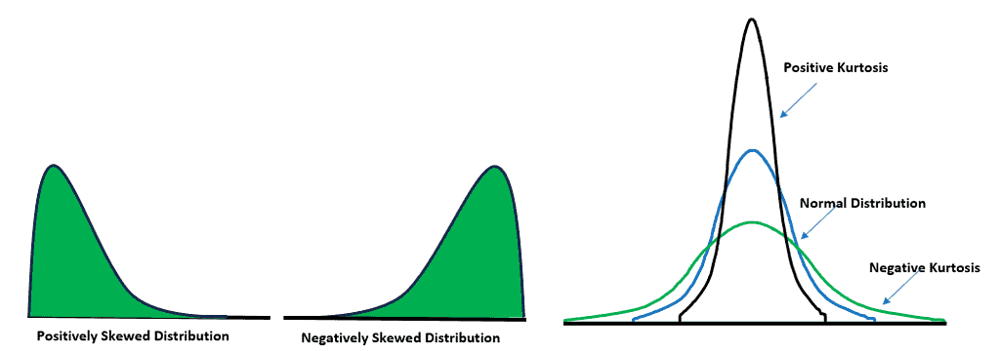
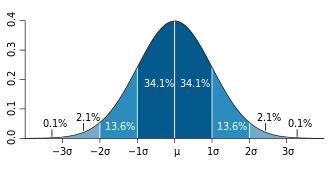

## There are many techniques that we can use to handle the missing data:

1.  Mean/Median Imputation: Replace the missing data with the mean or median of the avaliable data, Median is better for the age data because it's not affected by outliers.
2.  Mode Imputation: Replace the mssing data with the Mode of the avilable data, this could be a good choice if the patients are usually from the same age.
3.  KNN Imputation: Replace the missing data with the value of the nearest neighbor in the dataset, this method is good for treating the age because it will compare the similar patients.
4.  Deletion: to delete the records where the age is missing, this will cause us to lose 15% of the data which is a large percentage and will affect the performance of the model.

## We can use the below to detect the outliers:

**Z-Score**: Calculate the Z-score ((Mean - value) / Standard deviation) for trade volumes. Values with a Z-score greater than 3 (or less than -3) can be considered outliers.

**IQR (Interquartile Range)**: Calculate the IQR and identify outliers as values below lower bound or above upper bound.

- Q1 is the median of the first half
- Q3 is the median of the second half
- IQR = Q3 - Q1
- lower bound = Q1 - 1.5 X IQR
- upper bound = Q3 + 1.5 X IQR

## Normalization vs Standardization

### Normalization

Normalization rescales the features to a range, typically [0, 1] or [-1, 1].
X normalized = (X − X min) / (X max − X min)

**​Effects on Data:**

**Rescaling:** Each feature is rescaled based on its minimum and maximum values.

**Distribution:** The shape of the distribution of each feature remains unchanged; only the scale is adjusted.

**​Choose normalization** if your data is **not normally distributed** and you have algorithms that are sensitive to the scale of features, such as k-NN or when the feature values need to be in a specific range for some reason.

### Standardization

Standardization transforms the data to have a mean of 0 and a standard deviation of 1. The formula for standardization is:

X standardized = 𝑋 − 𝜇 / 𝜎
where
μ is the mean and σ is the standard deviation of the feature.

Effects on Data:

- Zero Mean: Each feature will have a mean of 0.
- Unit Variance: Each feature will have a standard deviation of 1.
- Preserved Shape: The shape of the distribution remains the same, but it is rescaled and shifted.

**Choose standardization** if your data follows a **normal distribution** or when using algorithms that assume normally distributed data, such as linear regression, logistic regression, or SVM. It's also a good choice for robust handling of outliers.

