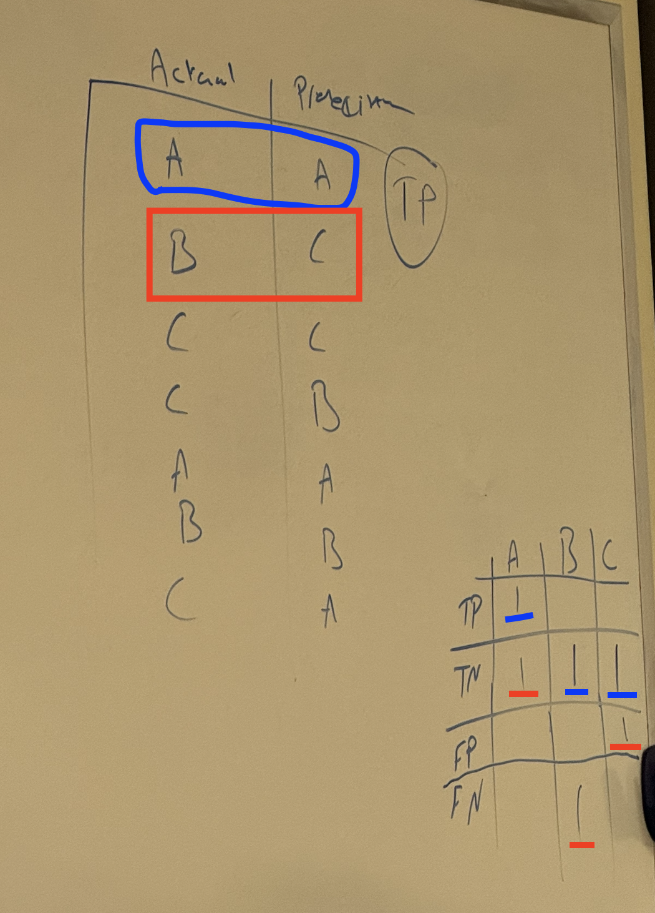

## Sigmoid Function vs. Gradient Descent

Sigmoid Function is used to convert the result of the regression to a value between 0 and 1
Gradient Descent is used to enhance the coefficients to give better performance when we predict

## Gradient Descent

Learning rate (alpha in logistic regression) is how big is the step to make each time

## Accuracy

- TP = True Positives (correctly predicted positive class)
- TN = True Negatives (correctly predicted negative class)
- FP = False Positives (incorrectly predicted as positive class)
- FN = False Negatives (incorrectly predicted as negative class)
  

## Precision vs Recall

Recall is preferred when you try to correctly predict as many as you can, ex. firewall with hacking request, in this case recall is better because false predicting that a request is hacking request is much worst than not predicting an actual hacking request.

Precision is preferred when false alarms are very dangerous, so we prefer Precision to reduce the false alarms.
