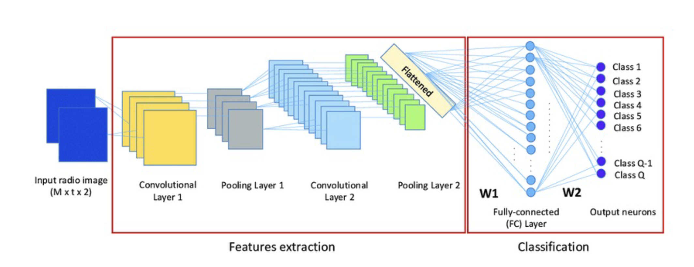

## Dirty data

- Missing Values
- Duplicate Data
- Inconsistent Data
- Outliers

## Strategies for Handling Missing Values

- Deletion: When the dataset is large and the missing data is minimal and randomly distributed
- Mean/Median/Mode Imputation: For numerical data (mean, median) when data distribution is not heavily skewed; for categorical data (mode), or when missing data is not significant.
- Prediction Models: When missing values are significant and there's a clear pattern or relationship that can be modeled.
- K-Nearest Neighbors (KNN): When data is not randomly missing and similar data points can provide a reasonable imputation value.

```
Choose mean/median for numerical data based on distribution. Use mode for categorical data.
Utilize prediction models or KNN when missingness is systematic and patterns can be identified.
```

## Normalization vs Standardization

### Normalization

Normalization rescales the features to a range, typically [0, 1] or [-1, 1]. X normalized = (X − X min) / (X max − X min).
​Choose normalization if your data is not normally distributed and you have algorithms that are sensitive to the scale of features, such as k-NN or when the feature values need to be in a specific range for some reason.

### Standardization

Standardization transforms the data to have a mean of 0 and a standard deviation of 1. The formula for standardization is:
X standardized = 𝑋 − 𝜇 / 𝜎
where
μ is the mean and σ is the standard deviation of the feature.

Choose standardization if your data follows a normal distribution or when using algorithms that assume normally distributed data, such as linear regression, logistic regression, or SVM. It's also a good choice for robust handling of outliers.

## Outliers

### Z-Score

Calculate the Z-score ((Mean - value) / Standard deviation) for trade volumes. Values with a Z-score greater than 3 (or less than -3) can be considered outliers.

### IQR (Interquartile Range)

Calculate the IQR and identify outliers as values below lower bound or above upper bound.

- Q1 is the median of the first half
- Q3 is the median of the second half
- IQR = Q3 - Q1
- lower bound = Q1 - 1.5 X IQR
- upper bound = Q3 + 1.5 X IQR

### Outlier Treatment

- Removal
- Transformation
- Imputation
- Capping

## Data Cleaning vs Data Cleansing

Data cleaning is a subset of data cleansing, focusing specifically on error rectification. Data cleansing encompasses a broader set of activities aimed at improving data quality and usability.

## Cleaning Unstructured Data

### Text Data

- Text Normalization: Convert text to a uniform case (lowercase or uppercase).
- Removing Special Characters and Numbers: Use regex patterns to keep only alphabetic characters, when numbers and symbols are not useful.
- Tokenization: Breaking down a stream of text into words, phrases, symbols, or other meaningful elements called tokens.
- Stop Words Removal: Eliminate common words that carry little useful information (e.g., "the", "is", "and").
- Stemming and Lemmatization: Reduce words to their base or root form to simplify analysis.

### Image and Video Data

- Noise Reduction: Apply filters to remove irrelevant visual noise.
- Standardization: Convert images to a standard size and format.
- Feature Extraction: Use techniques to identify and extract relevant features for analysis.

## Handling Imbalanced Data

Imbalanced data occurs when the distribution of classes is not uniform. Typically, one class (the majority class) has significantly more instances than the other class (the minority class).

### Challenges:

- Bias in Model Training: Machine learning models tend to be biased towards the majority class, leading to poor performance on the minority class.
- Performance Metrics: Standard metrics like accuracy can be misleading. For example, if 95% of the data is from the majority class, a model that always predicts the majority class will be 95% accurate, but it will fail to identify the minority class.
- Risk of Overfitting: Models may overfit to the majority class data, capturing noise rather than true patterns.

### Strategies for Imbalanced Data

- Oversampling
  - #### Techniques:
    - Random Oversampling
    - SMOTE (Synthetic Minority Over-sampling Technique): Generate new synthetic samples by interpolating between existing minority class samples.
      `we use KNN then we randomly select one of the neighbors and we create value between the value and the neighbor`
- Undersampling
  - #### Techniques:
    - Random Undersampling
    - Cluster-based Undersampling

## Regression

### The Goals of Regression Analysis

- Predictive Modeling
- Causal Inference
- Variable Relationship Exploration
- Optimization
- Hypothesis Testing

### Evaluating Linear Regression Models

- Mean Squared Error (MSE)
- Root Mean Squared Error (RMSE)

### Linear Regression

Models the relationship between a dependent variable and one or more independent variables using a straight line (linear equation).

### Polynomial Regression

A form of regression analysis where the relationship between the independent variable x and the dependent variable y is modeled as an nth degree polynomial.

### Mitigating Overfitting:

- Regularization: is a technique used to prevent overfitting by discouraging overly complex models in regression. This is achieved by introducing a penalty term to the loss function used to fit the model. The key idea is to impose a cost on larger coefficients. Regularization methods shrink the regression coefficients by imposing a penalty on their size.

- Cross-Validation: Use techniques like k-fold cross-validation to ensure the model generalizes well.

## Classification

### Encoding Categorical Variables

- One-Hot Encoding
- Ordinal Encoding

## Logistic regression

weights starts with 0 and a learning rate alpha = 0.1
Gradient Descent is used to update the weights to reduce the error
Sigmoid (activation function) is used to convert the value to a value between 0 and 1, above .5 is class and below .5 is a class

### Evaluation of classification

- TP = True Positives (correctly predicted positive class)
- TN = True Negatives (correctly predicted negative class)
- FP = False Positives (incorrectly predicted as positive class)
- FN = False Negatives (incorrectly predicted as negative class)

Recall is preferred when you try to correctly predict as many as you can, ex. firewall with hacking request, in this case recall is better because false predicting that a request is hacking request is much worst than not predicting an actual hacking request.
𝑇𝑃 / 𝑇𝑃 + 𝐹N

Precision is preferred when false alarms are very dangerous, so we prefer Precision to reduce the false alarms.
𝑇𝑃 / 𝑇𝑃 + 𝐹𝑃

F1 Score is a mix of recall and precision

Confusion Matrix: A Confusion Matrix is a table used to describe the performance of a classification model

## Artificial Neural Networks (ANNs)

### Perceptron

is the simplest form of neural network, which is one hidden layer with one neuron in it.
Limitations: inability to solve problems that are not linearly separable.


### activation functions:

- sign function (if the y = output > 0 ? 1 : -1)
- sigmoid (0,1) best use is in the output
- Hyperbolic Tangent (Tanh) (-1,1)
  Best Use: Hidden layers in many architectures, especially when the data is centered around zero.
- ReLU (Rectified Linear Unit) (0, &) best use when you don't have negative like photos
- Softmax (0,1 but the sum =1)


Each neuron receive a data then do the calculation and produce a single value then send it to the next layer.

A single neuron perform the below formula which is the regression + activation function to produce the single value that it will pass to the next layer.

- f is the activation
- w is the wights (coefficients)
- x is the features
- b is the bias


### how it work:

- first get random weights
- define the learning rate
- call the predict function (forward pass)
- check the loss function
- update the weights (backward propagation)
- call the predict again
- stopping the loop depends on the need (epochs, until it reach specific loss or if the loss is not enhancing in n number of tries)

## Convolution

### Parameters of the Convolution Layer

- Filters/Kernels
- Kernel Size
- Stride
- Padding: Same, valid
- Activation Function: ReLU, typically applied to introduce non-linearity, enabling the network to learn more complex patterns.

### Initialization and Learning of Kernels

Initially, the values of the kernels are set randomly and are learned and adjusted through backpropagation as the network is trained. During training, the network uses gradient descent (or variants thereof) to minimize the loss function, adjusting the kernel values to better extract the features that are relevant for the task.

### Convolution Layers

The primary function of the convolutional layer is to apply various filters (or kernels) to the input image to create feature maps.

- Feature Detection
- Spatial Relationships

### Pooling Layers

The Pooling Layer, often referred to as a Subsampling or Downsampling Layer, is integral to Convolutional Neural Networks for its role in reducing the spatial dimensions

- Strategic Function

  - Dimensionality Reduction
  - Feature Preservation
  - Overfitting Control

- Types of Pooling
  - Max Pooling
  - Average Pooling

### Dropout Layers

The Dropout Layer has emerged as a remarkably simple yet highly effective tool for regularizing neural networks, particularly in the context of deep learning. By randomly omitting a subset of neurons in the network during training.

- Benefits
  - Model Generalization
  - Reduced Overfitting
  - Simple yet Effective

### Flatten Layer

This layer is used after all the Convolutional layers and before the first Fully Connected layer to covert the arrays from 2d to 1d

### The Fully Connected Layers

these are the ANN layers

### Output Layer

The output layer serves as the bridge between the high-dimensional, abstract feature representations learned by the network and the specific format required by the task, effectively translating complex patterns into understandable predictions.



## Decision Tree

### Types of Decision Trees

- Classification Trees
- Regression Trees

A Decision Tree is composed of

- Root Node
- Branches
- Internal Nodes
- Leaf Nodes

### Split Criteria

- Gini Impurity
- Entropy/Information Gain
- Variance Reduction: Used in regression tree

### How Decision Trees Work

- Feature Selection
- Criteria for Feature Selection

### 1. Gini Impurity

- Gini Impurity is a measure used in decision trees to determine the probability of a randomly chosen element being incorrectly labeled
- Lower Gini Impurity Indicates Higher Purity <
- A Gini score of 0 indicates perfect purity;
- Post-Split Decision Making in Decision Trees
  - The tree will try to evaluate all the possible features with all the possible splits until it reach to the minimum Gini Impurity value, then it will repeat for all the child nodes and it will Consider All Features Again for the Next Split
- Stopping Criteria: When Does a Node Become a Leaf?
  - All Instances Belong to the Same Class
  - No Remaining Features Offer Improvement
  - Minimum Node Size Reached
  - Maximum Depth Reached
  - Pre-defined Minimum Improvement Threshold

### 2. Information Gain

Information Gain measures the reduction in entropy or uncertainty about the target variable after partitioning the dataset based on a particular feature.

- The best split is the one with the highest Information Gain.

### 3. Variance Reduction

Our goal is to reduce the Variance Reduction
How it work

- Traversal
- Reaching a Leaf
- Prediction Output: mean or median of the target values

## Random Forests

At its core, a Random Forest is an ensemble learning method that operates by constructing a multitude of decision trees at training time and outputting the class that is the mode of the classes (classification) or mean prediction (regression) of the individual trees.

### How Random Forests Work

- Bootstrap Aggregating (Bagging): Random Forests apply the bagging technique, where multiple decision trees are trained on different subsets of the training data, sampled with replacement. This process introduces diversity among the trees through varied training samples. Creating Unique Datasets: Random Forests employ bagging by creating bootstrapped datasets. Foreach tree, a new dataset is generated by randomly sampling instances from the original dataset with replacement, ensuring each tree has a unique training dataset.

- Feature Randomness: Random Feature Selection, When splitting a node during the construction of the tree, the choice of the feature to split on is made from a random subset of the total features.
- Aggregation of Predictions: For classification tasks, the final prediction is typically made by majority voting among the decision trees. For regression tasks, the average outcome of all trees is considered./ Majority Voting(Classification), Averaging (Regression)
