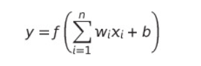

```
Dirty data can significantly compromise the integrity of data analysis

- Accuracy
- Performance
- Decision-making
```

```
types of dirty data
- Missing Values
- Inconsistent Data
- Outliers
- Duplicate records
```

```
Handling Missing Values
- Deletion
- Mean/Median/Mode Imputation
- Prediction Models
- K-Nearest Neighbors (KNN)

Considerations:
- Data Distribution: Choose mean/median for numerical data based on distribution. Use mode for categorical data.
- Amount of Missing Data: Extensive missing data may require advanced imputation techniques or careful deletion.
- Underlying Patterns: Utilize prediction models or KNN when missingness is systematic and patterns can be identified.
```

```
data preprocessing
- Normalization
Normalization rescales the features to a range, typically [0, 1] or [-1, 1]. X normalized = (X − X min) / (X max − X min).
​Choose normalization if your data is not normally distributed and you have algorithms that are sensitive to the scale of features, such as k-NN or when the feature values need to be in a specific range for some reason.

- Standardization
Standardization transforms the data to have a mean of 0 and a standard deviation of 1. The formula for standardization is:
X standardized = 𝑋 − 𝜇 / 𝜎
where
μ is the mean and σ is the standard deviation of the feature.

Choose standardization if your data follows a normal distribution or when using algorithms that assume normally distributed data, such as linear regression, logistic regression, or SVM. It's also a good choice for robust handling of outliers.
```

```
Z-Score: Calculate the Z-score ((Mean - value) / Standard deviation) for trade volumes. Values with a Z-score greater than 3 (or less than -3) can be considered outliers.

IQR (Interquartile Range): Calculate the IQR and identify outliers as values below lower bound or above upper bound.

- Q1 is the median of the first half
- Q3 is the median of the second half
- IQR = Q3 - Q1
- lower bound = Q1 - 1.5 X IQR
- upper bound = Q3 + 1.5 X IQR

Outlier Treatment
- Removal
- Transformation
- Imputation
- Capping
```

```
Challenges in Cleaning Unstructured Data
- Variability and Complexity
- Lack of Predefined Format
- Text Normalization: Convert text to a uniform case (lowercase or uppercase)
- Removing Special Characters and Numbers
- Tokenization: Breaking down a stream of text into words, phrases, symbols, or other meaningful elements called tokens.
- Stop Words Removal
- Stemming and Lemmatization: Reduce words to their base or root form to simplify analysis.
- Noise Reduction: Apply filters to remove irrelevant visual noise.
- Standardization: Convert images to a standard size and format.
- Feature Extraction: Use techniques to identify and extract relevant features for analysis.
```

```
Handling Imbalanced Data
Imbalanced data occurs when the distribution of classes is not uniform. Typically, one class (the majority class) has significantly more instances than the other class (the minority class).
Challenges:
- Bias in Model Training: Machine learning models tend to be biased towards the majority class, leading to poor performance on the minority class.
- Performance Metrics: Standard metrics like accuracy can be misleading. For example, if 95% of the data is from the majority class, a model that always predicts the majority class will be 95% accurate, but it will fail to identify the minority class.
- Risk of Overfitting: Models may overfit to the majority class data, capturing noise rather than true patterns.

Strategies for Imbalanced Data
- Oversampling
    Techniques:
        - Random Oversampling
        - SMOTE (Synthetic Minority Over-sampling Technique): Generate new synthetic samples by interpolating between existing minority class samples.
            we use KNN then we randomly select one of the neighbors and we create value between the value and the neighbor
- Undersampling
    Techniques:
        - Random Undersampling
        - Cluster-based Undersampling
```

```
The Goals of Regression Analysis
- Predictive Modeling
- Causal Inference
- Variable Relationship Exploration
- Optimization
- Hypothesis Testing
```

```
Evaluating Linear Regression Models
- Mean Squared Error (MSE)
- Root Mean Squared Error (RMSE)
```


```
Linear Regression: Models the relationship between a dependent variable and one or more independent variables using a straight line (linear equation).
Polynomial Regression: A form of regression analysis where the relationship between the independent variable x and the dependent variable y is modeled as an nth degree polynomial.

Mitigating Overfitting:
- Regularization: is a technique used to prevent overfitting by discouraging overly complex models in regression. This is achieved by introducing a penalty term to the loss function used to fit the model.

- Cross-Validation: Use techniques like k-fold cross-validation to ensure the model generalizes well.
```

```
Encoding Categorical Variables
- One-Hot Encoding
- Ordinal Encoding
```

```
Logistic regression
weights starts with 0
Gradient Descent is used to update the weights to reduce the error
Sigmoid (activation function) is used to convert the value to a value between 0 and 1, above .5 is class and below .5 is a class
```

```
Evaluation of classification

- TP = True Positives (correctly predicted positive class)
- TN = True Negatives (correctly predicted negative class)
- FP = False Positives (incorrectly predicted as positive class)
- FN = False Negatives (incorrectly predicted as negative class)

Recall is preferred when you try to correctly predict as many as you can, ex. firewall with hacking request, in this case recall is better because false predicting that a request is hacking request is much worst than not predicting an actual hacking request.
𝑇𝑃 / 𝑇𝑃 + 𝐹N

Precision is preferred when false alarms are very dangerous, so we prefer Precision to reduce the false alarms.
𝑇𝑃 / 𝑇𝑃 + 𝐹𝑃

F1 Score is a mix of recall and precision

Confusion Matrix: A Confusion Matrix is a table used to describe the performance of a classification model
```

```
Perceptron: is the simplest form of neural network, which is one hidden layer with one neuron in it.
Limitations: inability to solve problems that are not linearly separable.

activation functions:
- sign function (if the y = output > 0 ? 1 : -1)
- sigmoid (0,1) best use is in the output
- Hyperbolic Tangent (Tanh) (-1,1)
    Best Use: Hidden layers in many architectures, especially when the data is centered around zero.
- ReLU (Rectified Linear Unit) (0, &) best use when you don't have negative like photos
- Softmax (0,1 but the sum =1)
```

## Artificial Neural Networks (ANNs)


Each neuron receive a data then do the calculation and produce a single value then send it to the next layer.

A single neuron perform the below formula which is the regression + activation function to produce the single value that it will pass to the next layer.

- f is the activation
- w is the wights (coefficients)
- x is the features
- b is the bias




### how it work:

- first get random weights
- define the learning rate
- call the predict function (forward propagation)
- check the loss function
- update the weights (backward propagation)
- call the predict again
- stopping the loop depends on the need (epochs, until it reach specific loss or if the loss is not enhancing in n number of tries)
